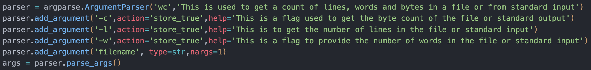

# WC Tool
This is an implementation of the `wc` command present in unix systems, in python. The `wc` command is used to count the number of bytes, words, and lines in a file. It can also be used to count the number of charaters in a file based on the locale settings. The input to the command can also be a pipe from the standard input such as from the `cat` command.
\newline
The `wc` command can be used in the following way:
```bash
python3 ccwc.py  [OPTION]... [FILE]...
```
The options that can be used with the `wc` command are:
- `-c` : This option is used to count the number of bytes in a file.
- `-m` : This option is used to count the number of characters in a file.
- `-l` : This option is used to count the number of lines in a file.
- `-w` : This option is used to count the number of words in a file.

The `wc` command can be used with multiple files as well. In that case, the `wc` command will display the total number of bytes, words, and lines in all the files. If no option is provided, the `wc` command will display the number of bytes, words, and lines in the file along with the file name.

## Learnings
### Handling command line arguments
- First was to parse command line arguments in python. You can make use of `sys.argv` parameter, which holds the list of command line arguments with sys.argv[0] being the script name, followed by others. Another, and more convinient method is to use the `argparse` module. 

- `argparse` gives us better control on what, which type and actions on the command line arguments the script accepts. It also provides Exception handling for misuse or incorrect command line arguments.
In my case, I had to provide just a single input parameter, which is the filename or standard input, and a some flags which determine the output(what is done with the file). For this reason, i went with the below config



- The args are mentioned in the order they are expected and the type of input the accept. For the flags, I have set the action to set value to `True` is it is included. When the arguments are parsed, it is available as a list of tuples.
The flag values can be accessed as `args.c` as value associated is implicitly a Boolean. 

- For the file name argument, it gets a bit tricky as we also need to accept standard input through a pipe (`<stdin>`), hence we cannot just acccept a string type.
For this, we accept arguments of type `argparse.FileType('r')`. This allows you to pass an argument of both a filename which will be loaded in buffer as a `_io.TextIOWrapper` object (simillar to opening a file with the `open()` method), and accept standard input pipes straight into the object buffer. we provide the default as `<stdin>`.
We supply the number of args attribute as `nargs='?'`.

### Custom Print
The output to be shown required multiple print statements on the same line. Here I used the `end=` attribute in the print statement to describe a custom ending for every print. By default, it is `end='\n'`, which is why every print results in a newline.


## References
1. [splitlines()](https://docs.python.org/3/library/stdtypes.html#str.splitlines)
2. [Size of string in bytes](https://stackoverflow.com/questions/30686701/python-get-size-of-string-in-bytes)
3. [_io.IOBase module docs](https://docs.python.org/3/library/io.html#io.TextIOBase)
4. [argparse docs](https://docs.python.org/3/library/argparse.html)


